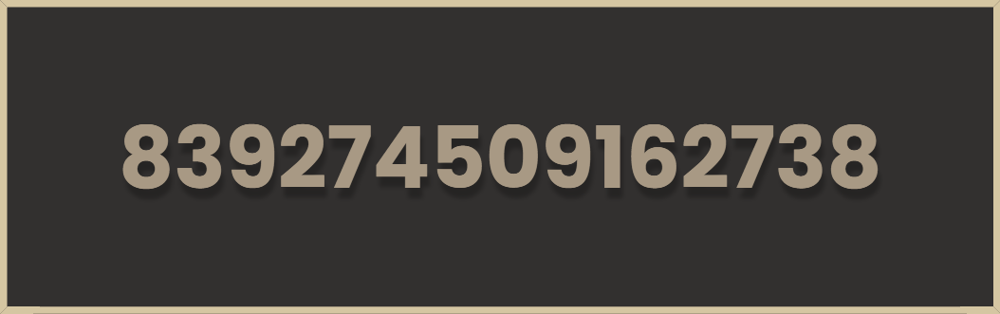

  

  

  

## <h3 align="center">📚 Currently Learning</h3>

- **Backend Development**
  - **Go, Python, JS, C**

          

## <h3 align="center">💻 Languages and Tools</h3>

 

          

## <h3 align="center">📊 Stats</h3>

 

 

&nbsp;

## <h3 align="center">📖 Quotes</h3>

 

  

 
